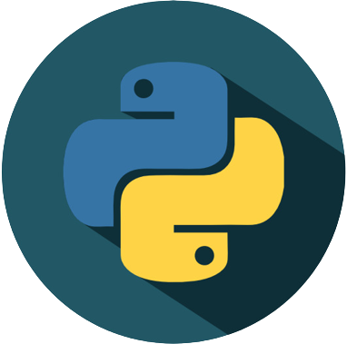

<!-- PROJECT SHIELDS -->
<!--
*** I'm using markdown "reference style" links for readability.
*** Reference links are enclosed in brackets [ ] instead of parentheses ( ).
*** See the bottom of this document for the declaration of the reference variables
*** for contributors-url, forks-url, etc. This is an optional, concise syntax you may use.
*** https://www.markdownguide.org/basic-syntax/#reference-style-links
-->
[![pre-commit][pre-commit-shield]][pre-commit-url]
[![Imports: isort][isort-shield]][isort-url]
[![Code style: black][black-shield]][black-url]


<!-- PROJECT LOGO -->
<br />
<div align="center">
  <a href="https://github.com/KudoKhang/python-project-template">
    
  </a>

  <h3 align="center">Python Project Template</h3>

  <p align="center">
    A Template for AI module build with python!
    <br />
    <a href="docs/"><strong>Explore the docs »</strong></a>
    <br />
    <br />
    <a href="#">View Demo</a>
    ·
    <a href="https://github.com/KudoKhang/python-project-template/issues">Report Bug</a>
    ·
    <a href="https://github.com/KudoKhang/python-project-template/issues">Request Feature</a>
  </p>
</div>

---

<!-- 📋 TABLE OF CONTENTS -->
## 📋 Table of Contents
* [About the Project](#about-the-project)
  * [Built With](#built-with)
* [Getting Started](#getting-started)
  * [Prerequisites](#prerequisites)
  * [Installation](#installation)
* [Usage](#usage)
* [Contributing](#contributing)
* [Contributors](#contributors)


<!-- ABOUT THE PROJECT -->
<h2 id="about-the-project"> 📑 About The Project </h2>


Introduce your module here

<h3 id="built-with"> 💻 Built With </h3>

This section should list any major frameworks/libraries used to bootstrap your project. Here are a few examples.

* [pre-commit](https://pre-commit.com/)
* [CI/CD](https://docs.gitlab.com/ee/ci/pipelines/)
* [Docker](https://www.docker.com/)
* ...


<!-- GETTING STARTED -->
<h2 id="getting-started"> 🛠 Getting Started </h2>


<h3 id="prerequisites"> 📎 Prerequisites </h3>

- Ubuntu
- Python `3.8.16`
- Pip `23.0.1`
- Conda `4.12.0`

<h3 id="installation"> ⚙️ Installation </h3>

1. Clone the repo

```bash
git clone https://github.com/KudoKhang/python-project-template
```

2. Install packages

⚒️ __CONDA__

Create your conda virtual environment, activate it and install packages from `requirements.txt`

```bash
conda create your_env python=3.8
conda activate your_env
pip3 install -r requirements.txt
```

⚔️ __DOCKER__

```bash
docker compose -f docker-compose.yml run your_service

# Using GPU, make sure `cuda` is available in your device
docker compose -f docker-compose.yml run your_service_gpu
```


3. Install pre-commit

- `pre-commit` will check the PEP8 format before committing. If the code does not comply with PEP8 format, `isort` & `black` will be automatically refactored code
- auto testing with pytest before push code to GitLab

```bash
pre-commit install --hook-type pre-commit --hook-type pre-push --allow-missing-config
```


<!-- USAGE EXAMPLES -->
<h2 id="usage"> 🤖 Usage </h2>

1. Change pretrained model at `conf/config.yaml`

2. Run
```python
python3 script/inference.py
```

3. Test
```python
pytest
```


<!-- ROADMAP -->
<h2 id="roadmap"> 🛤 Roadmap </h2>

- [x] CI/CD
- [ ] Release package


See the [open issues][issue] for a full list of proposed features (and known issues).


<!-- CONTRIBUTING -->
<h2 id="contributing"> 👋 Contributing </h2>

1. Fork the Project
2. Create your Feature Branch (`git checkout -b feat/docs`)
3. Commit your Changes (`git commit -m 'feat: add something'`)
4. Push to the Branch (`git push origin feat/docs`)
5. Open a Pull Request


<!-- 👨‍💻 CONTACT -->
<h2 id="contributors"> 👨‍💻 Contributors </h2>

🐤 [KudoKhang][profile] 🐤


<!-- MARKDOWN LINKS & IMAGES -->
<!-- https://www.markdownguide.org/basic-syntax/#reference-style-links -->
[profile]: https://github.com/KudoKhang
[issue]: https://github.com/KudoKhang/python-project-template/issues
[project]: https://github.com/KudoKhang/python-project-template 
[pre-commit-shield]: https://img.shields.io/badge/pre--commit-enabled-brightgreen?logo=pre-commit
[pre-commit-url]: https://github.com/pre-commit/pre-commit
[isort-shield]: https://img.shields.io/badge/%20imports-isort-%231674b1?style=flat&labelColor=ef8336
[isort-url]: https://pycqa.github.io/isort/
[black-shield]: https://img.shields.io/badge/code%20style-black-000000.svg
[black-url]: https://github.com/psf/black
